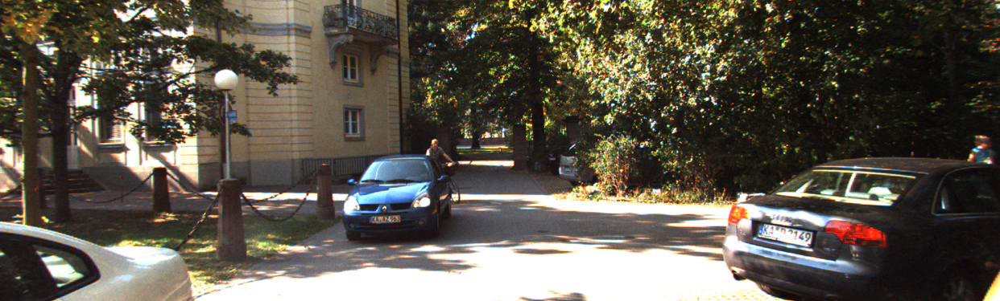
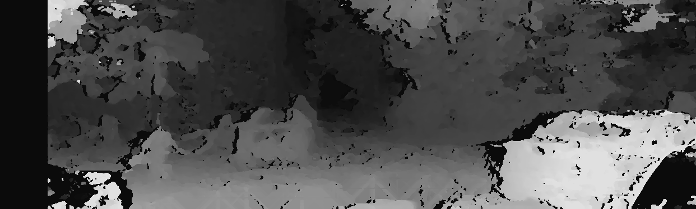

# Reconstruction
- 特征点检测和匹配
  - ORB
  - to do: SIFT
- 计算R和t
  - 八点法获取R和t + 特征点深度
  - bundle adjustment计算R和t + 特征点深度
- Rectify
  - to do: 但是感觉即使用bundle adjustment得到的R和t精度也不够
- Dense matching
  - semi global matching
  - 基于学习
  - to do： 
    - block matching
    - 调参面板
- 深度图质量评估
  - to do 
- 可视化: 由深度图和相机内参得到点云
  - to do

# Dataset 
- KITTI_TEST
  - ./test_images/kitti_test_01
  - 这个数据集中包含左右两张图像， 是KITTI中rectified的两张图像(rectified KITTI - 2011_09_26_drive_0113_sync - 0.png)
- MATLAB_TEST
  - ./test_images/matlab
  - 这个数据集中包含左右两张rectified的图像，来源于CV2的exe6
- KITTI_2011_09_26_drive_0048
  - KITTI官网Raw Data
  - 2011_09_26_drive_0048 (0.1 GB)
  - Length: 28 frames (00:02 minutes)
  - Image resolution: 1392 x 512 pixels
  - Labels: 7 Cars, 1 Vans, 0 Trucks, 0 Pedestrians, 0 Sitters, 0 Cyclists, 0 Trams, 0 Misc
- KITTI_2011_09_26_drive_0113

# 存在的问题

# 已验证
- KITTI数据集中的K (calibration matrix) 在经过rectified后, 发生了变化 (kitti_kit.cpp)
- 八点法的鲁棒性较差，得到的R和t精度不行
- 计算R和t需要很多特征点 (200+?)

# Note
* 目前undistort.cpp中的相机内参和畸变参数为直接赋值，如果引入其他的需要去畸变的数据集需要注意。

# 环境
- OpenCV 3.2
- Eigen 3
- g2o @ 9b41a4e

# 实验结果
- KITTI rectified image (left rgb)
  
- disparity map from sgm
  
- R和t的估算
  - 八点法
  
    - R和t:
  $$
  \left[
  \begin{matrix}
      0.9998050317301672 & -0.01973988720867603 & 0.0004851597964776189 \\
       0.01972332024661993 & 0.9995362024675716 & 0.02320281438005439 \\
      -0.000942955719347105 & -0.02318872160544275 & 0.99973066074059
  \end{matrix}
  \right]
  $$

  $$
  \left[
  \begin{matrix}
      -0.001032302587118445 \\
       7.174486476482287e-05 \\
      0.0009532134213666677
  \end{matrix}
  \right]
  $$

   - BundleAdjustment
     - R和t
    $$
  \left[
  \begin{matrix}
      0.746854 & 0.00590651  & -0.664961 \\
      -0.0455006 &  0.998071 & -0.0422388 \\
      0.663429 & 0.0618024 &   0.745682 
  \end{matrix}
  \right]
  $$

  $$
  \left[
  \begin{matrix}
      0.517458\\
      0.0317785\\
      0.340954
  \end{matrix}
  \right]
  $$

  - Ground truth
     - R和t
    $$
    \left[
    \begin{matrix}
        1 & 0  & 0 \\
        0 &  1 & 0 \\
        0 & 0 &   1 
    \end{matrix}
    \right]
  $$

  $$
    \left[
    \begin{matrix}
      0.5327119287764802\\
      -0.002752896950590371\\
      1.597899999998976e-05
    \end{matrix}
    \right]
  $$

